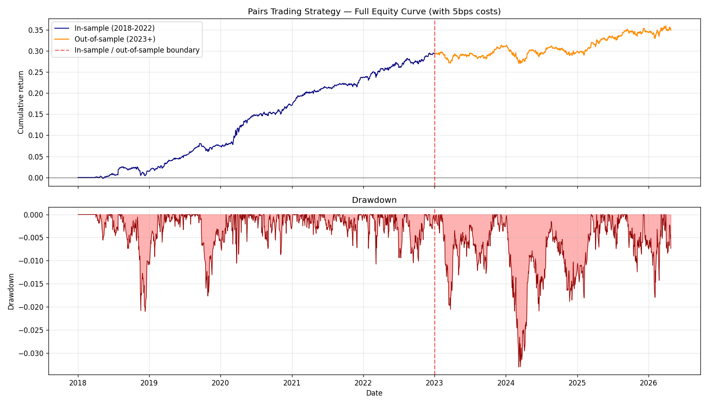
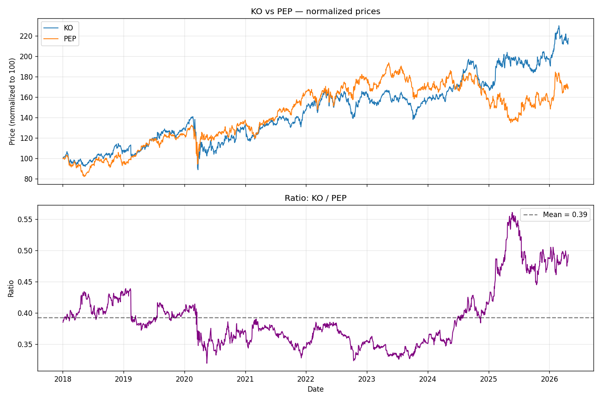
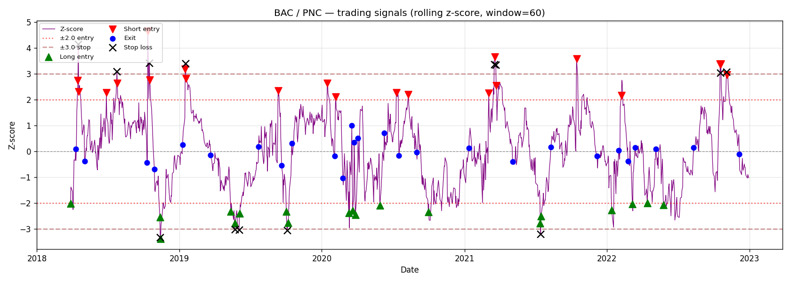
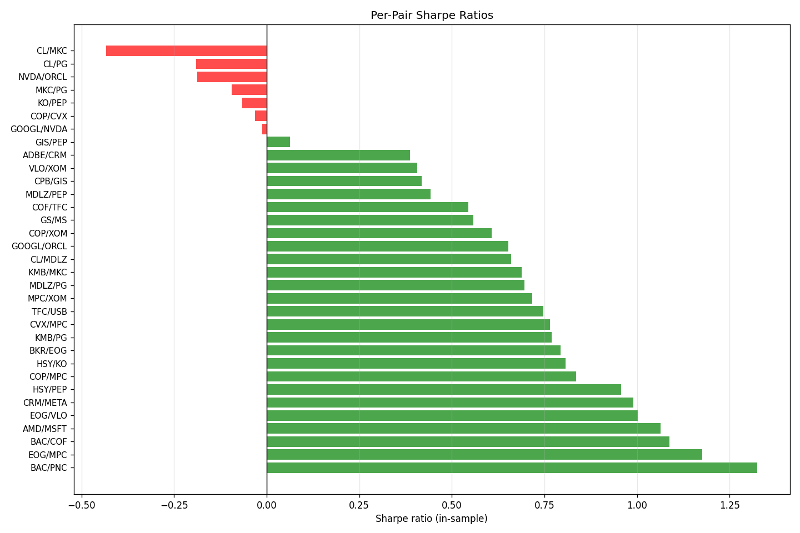

# Pairs Trading: A Cointegration-Based Statistical Arbitrage Strategy

An end-to-end implementation of a market-neutral pairs trading system on US equities, with rigorous in-sample / out-of-sample testing.

**TL;DR**: In-sample Sharpe 2.22 (2018-2022); out-of-sample Sharpe 0.50 (2023-2026), a 77% decay. The strategy remained profitable out-of-sample but with substantially reduced edge, consistent with academic literature documenting the long-running decline in returns to classic pairs trading on liquid US equities (Do and Faff, 2010).



---

## What this project does

This system identifies cointegrated pairs of stocks, generates mean-reversion trading signals from the spread, and executes a dollar-neutral pairs trading strategy. The full pipeline:

1. **Universe construction**: 40 US large-cap stocks across Technology, Financials, Consumer Staples, and Energy
2. **Cointegration testing**: Engle-Granger procedure on all 780 possible pairs (in-sample only)
3. **Pair filtering**: Statistical significance, half-life, sector, and hedge-ratio filters reduce the universe to 33 tradeable pairs (criteria detailed in Methodology section)
4. **Signal generation**: Rolling z-score with state-machine position management
5. **Backtest**: Dollar-neutral position sizing with realistic frictions, including 5 bps round-trip transaction costs and a 50 bps annual short-borrow cost
6. **Robustness analysis**: Stress tests including per-pair return attribution, parameter sensitivity sweeps, and drop-top-N analysis to verify the strategy isn't reliant on a few outlier pairs
7. **Out-of-sample test**: The strategy is applied unchanged to 2023-2026 data, simulating real-time deployment

---

## Headline results

| Metric | In-sample (2018-2022) | Out-of-sample (2023-2026) |
|---|---|---|
| Annual return | 5.19% | 1.30% |
| Annual volatility | 2.34% | 2.61% |
| Sharpe ratio | 2.22 | 0.50 |
| Max drawdown | -2.10% | -3.31% |
| Daily hit rate | 57.5% | 49.2% |
| Profit factor | 1.53 | 1.09 |

The in-sample Sharpe of 2.22 is high, but should not be taken at face value: it reflects pairs *selected* on the same 2018-2022 data they're evaluated on. The out-of-sample Sharpe of 0.50 is the honest test of strategy validity.

---

## Methodology

### Cointegration testing

Two non-stationary series $A_t$ and $B_t$ are cointegrated if a linear combination $A_t - \beta B_t$ is stationary. The Engle-Granger procedure tests this in two steps:

1. OLS regression: $A_t = \alpha + \beta B_t + \epsilon_t$
2. Augmented Dickey-Fuller test on residuals $\hat{\epsilon}_t$

Pairs with ADF p-value < 0.05 are considered statistically cointegrated. Of 780 tested pairs, 61 passed the significance threshold — broadly consistent with the ~39 false-positives expected from multiple testing at the 5% level.

To address multiple testing and economic plausibility, candidates were further filtered by:
- Half-life of mean reversion in [5, 60] days (Ornstein-Uhlenbeck estimation)
- Same sector (eliminates spurious cross-sector cointegrations)
- Hedge ratio β in [0.1, 10] (regression sanity)

This produced a final universe of **33 tradeable pairs**.

### Pair visualization

Strong cointegration is visible as a spread that mean-reverts around zero. Example: KO/PEP which depicts a canonical example of sector-level cointegration.



The bottom panel shows the price ratio oscillating around its mean which is exactly the behavior that the cointegration test formalizes.

### Signal generation

For each pair, the rolling z-score is computed using a 60-day lookback window:

$$Z_t = \frac{S_t - \mu_S^{(t-60:t)}}{\sigma_S^{(t-60:t)}}$$

A state machine generates trade signals:
- Enter long-spread when $Z < -2$ (spread is unusually low → expect reversion up)
- Enter short-spread when $Z > +2$
- Exit when $|Z|$ crosses zero (reverted to mean)
- Stop-loss when $|Z| > 3$ (spread blew out further)



### Backtest construction

Position sizing is **dollar-neutral**: equal dollar amounts on long and short legs, regardless of β. This is the standard professional approach for retail-scale statistical arbitrage. Daily P&L = $(r_A - r_B) / 2$ when long-spread, $(r_B - r_A) / 2$ when short-spread, and zero when flat. Capital is allocated equally across all 33 pairs.

Realistic frictions modeled:
- 5 bps round-trip transaction costs (commission + slippage)
- 50 bps annual borrow cost on short leg

### In-sample / out-of-sample split

All pair selection, parameter choices, and α/β estimation used **only** 2018-2022 data. The strategy was then applied unchanged to 2023-2026, simulating real-time deployment on Jan 1, 2023. No look-ahead bias.

---

## Robustness analysis (in-sample)

Several stress tests confirm the in-sample results were not driven by a few lucky pairs or specific parameter values:

- **Concentration**: Top 3 pairs contributed only 18% of returns; top 5 contributed 37%. Not concentrated.
- **Drop-top-N**: Removing the top 10 best in-sample pairs still yielded Sharpe 1.18.
- **Parameter sensitivity**: Sharpe ranged 1.59-2.28 across 18 combinations of (z_entry, z_stop, rolling_window). Stable.
- **Borrow costs**: Adding 50bps annual borrow reduced Sharpe by only 0.05.



Of the 33 pairs, 26 had positive in-sample Sharpe; 5 had Sharpe > 1.0.

---

## Out-of-sample findings

The 77% Sharpe decay reflects fundamental risk realized through structural sector breaks during 2023-2026, rather than the broad market panics that historically benefit pairs trading. Do and Faff (2010) document that pairs trading actually outperforms during prolonged turbulence (e.g., the 2000-2002 dotcom crash, the 2008 financial crisis): indiscriminate selling creates temporary mispricings that revert as panic subsides, leaving the underlying cointegration relationships intact. The 2023-2026 period saw a different kind of disruption — permanent regime shifts that broke historical cointegration relationships outright:

- **Regional banking crisis (March 2023)**: SVB collapse caused permanent rerating of regional banks relative to money-center banks (BAC/PNC: IS Sharpe 1.33 → OOS 0.26)
- **AI boom**: NVDA and AMD detached from semiconductor peers as their valuations entered a different regime
- **GLP-1 drug adoption**: disrupted consumer staples sub-sector dynamics, particularly between snack and beverage names
- **Post-COVID oil normalization**: split refiners from E&P names (EOG/VLO: IS Sharpe 1.00 → OOS -0.14)

These events represent **fundamental risk** in Do and Faff's taxonomy of arbitrage risks — the risk that two paired stocks diverge in value due to changes in underlying businesses, rather than mean-reverting around a stationary spread. Do and Faff attribute roughly 70% of the historical decline in pairs trading profitability to such arbitrage risks, rather than to the increased market efficiency typically blamed.

A second finding from the per-pair attribution: the correlation between in-sample and out-of-sample Sharpe across pairs was only **0.32**. Some in-sample top performers decayed sharply (BAC/PNC, EOG/VLO), while some middle-of-the-pack pairs improved (HSY/PEP: IS 0.96 → OOS 1.26). This suggests a meaningful component of in-sample top performance was overfitting to noise rather than robust signal — even with conservative filtering for significance, half-life, sector, and hedge ratio.

Despite the decay, **20 of 33 pairs (61%) maintained positive out-of-sample Sharpe**, indicating most cointegration relationships persisted in some form — just less profitably than 2018-2022.
---

## Extensions and future work

Several directions would extend this analysis and make the strategy more robust for live deployment:

- **Walk-forward parameter estimation**: Re-estimate α, β, and re-run cointegration tests on rolling windows rather than freezing 2018-2022 parameters
- **Larger universe**: Scan the full S&P 500 with proper multiple-testing correction (Bonferroni or FDR control), rather than the curated 40-stock universe used here
- **Survivorship-bias-free data**: Use a point-in-time database (Compustat or CRSP) to include delisted stocks, addressing a known limitation of free data sources like yfinance
- **Regime detection**: Identify periods when cointegration relationships break down (volatility spikes, sector-specific shocks) and reduce exposure during those periods
- **Higher-frequency signals**: Intraday data may capture mean reversion before slower retail-accessible signals decay
- **Multivariate cointegration**: Apply the Johansen procedure to identify cointegrated baskets of 3+ stocks, rather than just pairs
- **Volatility targeting**: Scale position sizes by recent volatility rather than equal weight, improving risk-adjusted returns

---

## Project structure

```
pairs-trading/
├── src/
│   ├── data_loader.py        # Pulls and caches Yahoo Finance price data
│   ├── explore_prices.py     # Sector-level and pair visualization
│   ├── cointegration.py      # Engle-Granger test and half-life estimation
│   ├── pair_selection.py     # Applies statistical and economic filters
│   ├── signals.py            # Rolling z-score and trade state machine
│   ├── backtest.py           # Dollar-neutral P&L with realistic costs
│   ├── robustness.py         # Sensitivity, attribution, drop-top-N stress tests
│   └── out_of_sample.py      # Out-of-sample validation on 2023-2026
├── data/                     # Cached prices and computation outputs
├── plots/                    # Generated figures
├── requirements.txt
└── README.md
```

---

## Setup and usage

```bash
git clone https://github.com/ymarda/pairs-trading.git
cd pairs-trading
python3 -m venv venv
source venv/bin/activate
pip install -r requirements.txt

# Run the full pipeline
python -m src.data_loader        # Download price data for the 40-stock universe 
python -m src.explore_prices     # Generate sector and pair visualizations
python -m src.cointegration      # Run Engle-Granger tests on all 780 pairs 
python -m src.pair_selection     # Apply filters to identify 33 tradeable pairs
python -m src.signals            # Generate rolling z-score trading signals
python -m src.backtest           # Run in-sample backtest (2018-2022)
python -m src.robustness         # Run stress tests and sensitivity analysis
python -m src.out_of_sample      # Validate strategy on 2023-2026 data
```

---

## References

- Engle, R. and Granger, C. (1987). "Co-integration and error correction: representation, estimation, and testing." *Econometrica*, 55(2), 251-276.
- Gatev, E., Goetzmann, W., and Rouwenhorst, K. (2006). "Pairs trading: Performance of a relative-value arbitrage rule." *Review of Financial Studies*, 19(3), 797-827.
- Do, B. and Faff, R. (2010). "Does simple pairs trading still work?" *Financial Analysts Journal*, 66(4), 83-95.
- Do, B. and Faff, R. (2012). "Are pairs trading profits robust to trading costs?" *Journal of Financial Research*, 35(2), 261-287.
- Krauss, C. (2017). "Statistical arbitrage pairs trading strategies: Review and outlook." *Journal of Economic Surveys*, 31(2), 513-545.